<div align="center">


# 🎯 JobTracker

**A full-stack Job Application Tracker with production-grade DevOps infrastructure on GCP.**

[](https://nodejs.org/)
[](https://expressjs.com/)
[](https://docker.com/)
[](https://terraform.io/)
[](https://helm.sh/)
[](LICENSE)

</div>

---

## About

JobTracker is a modern web application for managing job applications through their entire lifecycle — from wishlisted positions to accepted offers. It combines a **secure REST API** (Express.js, JWT auth, SQLite) with a **premium Tailwind CSS frontend** and ships with a **complete DevOps pipeline** spanning Docker, Kubernetes (GKE), Terraform, Jenkins CI/CD, ArgoCD GitOps, and Ansible.

## Features

- 🔐 **Secure Authentication** — Registration, login, JWT-based sessions, bcrypt password hashing
- 📋 **Full CRUD** — Create, read, update, delete job applications
- 🔄 **Status Workflow** — Track applications through: `wishlist → applied → interview → offer → accepted / rejected`
- 🔍 **Search & Filter** — Real-time search by company, position, or status
- 📊 **Dashboard Stats** — At-a-glance counters for total, active, interviews, and offers
- 🎨 **Premium UI** — Tailwind CSS light theme with gradient accents, animations, and responsive design
- 🐳 **Production DevOps** — Docker, Helm, Terraform, Jenkins, ArgoCD, Ansible — all included

## Architecture

```mermaid
graph TB
    subgraph Client["🌐 Frontend"]
        UI["HTML / Tailwind CSS / Vanilla JS"]
    end

    subgraph Server["⚙️ Backend (Express.js v5)"]
        AUTH["Auth Controller<br/>register · login · logout"]
        JOBS["Jobs Controller<br/>CRUD · status transitions"]
        MW["Middleware Stack<br/>JWT · Validation · Rate Limit · Helmet"]
    end

    subgraph Data["💾 Database"]
        DB["SQLite (sql.js)<br/>users · jobs"]
    end

    UI -->|"REST API<br/>JWT Bearer"| MW
    MW --> AUTH
    MW --> JOBS
    AUTH --> DB
    JOBS --> DB
```



## DevOps Pipeline

```mermaid
flowchart LR
    subgraph Dev["👨‍💻 Developer"]
        CODE["git push"]
    end

    subgraph CI["🔧 Jenkins CI/CD"]
        BUILD["npm install<br/>lint · test"]
        DOCKER["Docker Build<br/>Multi-stage"]
        PUSH["Push to<br/>Artifact Registry"]
    end

    subgraph CD["🚀 Deployment"]
        ARGO["ArgoCD<br/>GitOps Sync"]
        STAGING["GKE Staging<br/>auto-sync"]
        PROD["GKE Production<br/>manual approval"]
    end

    subgraph Infra["🏗️ Infrastructure"]
        TF["Terraform<br/>VPC · GKE · IAM"]
        ANSIBLE["Ansible<br/>Jenkins · Monitoring"]
    end

    CODE --> BUILD --> DOCKER --> PUSH
    PUSH --> ARGO
    ARGO --> STAGING --> PROD
    TF -.->|provisions| STAGING
    TF -.->|provisions| PROD
    ANSIBLE -.->|configures| BUILD
```



## Tech Stack

| Layer | Technology | Purpose |
|-------|-----------|---------|
| **Runtime** | Node.js 20 | JavaScript runtime |
| **Framework** | Express.js 5.x | HTTP server & routing |
| **Database** | sql.js (SQLite) | Zero-config embedded database |
| **Auth** | JWT + bcryptjs | Stateless auth with password hashing |
| **Validation** | express-validator | Request validation middleware |
| **Security** | Helmet, CORS, Rate Limit | HTTP hardening |
| **Frontend** | HTML + Tailwind CSS + Vanilla JS | Responsive SPA-like UI |
| **Containers** | Docker (multi-stage) | Reproducible builds |
| **Orchestration** | Kubernetes (GKE) + Helm | Scalable deployment |
| **IaC** | Terraform | GCP resource provisioning |
| **CI/CD** | Jenkins | Automated build/test/deploy |
| **GitOps** | ArgoCD | Declarative K8s deployments |
| **Config Mgmt** | Ansible | Server provisioning |
| **Monitoring** | Prometheus + Grafana | Metrics & dashboards |

## Quick Start

### Prerequisites

- [Node.js](https://nodejs.org/) ≥ 18
- [Docker](https://docker.com/) (optional, for containerized run)

### Local Development

```bash
# Clone the repo
git clone https://github.com/your-org/job-tracker.git
cd job-tracker

# Install dependencies
npm install

# Create environment file
cp .env.example .env
# Edit .env with your JWT_SECRET

# Start development server
npm run dev
# → http://localhost:3000
```

### Docker

```bash
# Production
docker compose up -d

# Development (hot reload)
docker compose --profile dev up app-dev
```

### Environment Variables

| Variable | Default | Description |
|----------|---------|-------------|
| `PORT` | `3000` | Server port |
| `JWT_SECRET` | — | **Required.** Secret for signing JWTs |
| `JWT_EXPIRES_IN` | `7d` | Token expiration time |
| `NODE_ENV` | `development` | Environment (`development` / `production`) |

## API Reference

### Authentication

| Method | Endpoint | Description | Auth |
|--------|----------|-------------|------|
| `POST` | `/api/auth/register` | Create new account | No |
| `POST` | `/api/auth/login` | Login, receive JWT | No |
| `POST` | `/api/auth/logout` | Invalidate session | Yes |

### Job Applications

| Method | Endpoint | Description | Auth |
|--------|----------|-------------|------|
| `GET` | `/api/jobs` | List all applications | Yes |
| `POST` | `/api/jobs` | Create application | Yes |
| `GET` | `/api/jobs/:id` | Get single application | Yes |
| `PUT` | `/api/jobs/:id` | Update application | Yes |
| `DELETE` | `/api/jobs/:id` | Delete application | Yes |
| `PATCH` | `/api/jobs/:id/status` | Change status | Yes |
| `GET` | `/api/health` | Health check | No |

### Status Transitions


## Project Structure

```
job-tracker/
├── server.js                     # Entry point
├── src/
│   ├── app.js                    # Express app setup
│   ├── config/
│   │   └── database.js           # SQLite init & schema
│   ├── controllers/
│   │   ├── auth.controller.js    # Auth logic
│   │   └── jobs.controller.js    # CRUD logic
│   ├── middleware/
│   │   ├── auth.js               # JWT verification
│   │   ├── errorHandler.js       # Global error handler
│   │   └── validate.js           # Validation rules
│   ├── routes/
│   │   ├── auth.routes.js        # Auth endpoints
│   │   └── jobs.routes.js        # Jobs endpoints
│   └── utils/
│       └── helpers.js            # Utility functions
├── public/                       # Frontend assets
│   ├── index.html                # SPA with Tailwind CSS
│   ├── css/style.css             # Custom animations
│   └── js/app.js                 # Client-side logic
├── Dockerfile                    # Multi-stage production build
├── docker-compose.yml            # Dev + prod profiles
├── Jenkinsfile                   # CI/CD pipeline
├── helm/job-tracker/             # Helm chart for GKE
├── terraform/                    # GCP IaC (VPC, GKE, GAR, IAM)
├── gitops/argocd/                # ArgoCD applications
└── ansible/                      # Server provisioning
```

## Deployment

### 1. Provision GCP Infrastructure (Terraform)

```bash
cd terraform

# Set your GCP project
sed -i 's/my-gcp-project-id/YOUR_PROJECT/' terraform.tfvars

terraform init
terraform plan
terraform apply
```

This creates: VPC + subnets, GKE cluster (private, autoscaling), Artifact Registry, IAM service accounts with Workload Identity.

### 2. Setup Jenkins Server (Ansible)

```bash
cd ansible
ansible-playbook playbooks/setup-jenkins.yml -i inventory/staging.ini
```

Installs: Jenkins, Docker, kubectl, Helm — ready for CI/CD pipelines.

### 3. Deploy to GKE (Helm)

```bash
# Connect to cluster
gcloud container clusters get-credentials job-tracker-gke \
  --region us-central1 --project YOUR_PROJECT

# Deploy staging
helm upgrade --install job-tracker ./helm/job-tracker \
  -f helm/job-tracker/values-staging.yaml \
  --namespace staging --create-namespace

# Deploy production
helm upgrade --install job-tracker ./helm/job-tracker \
  -f helm/job-tracker/values-prod.yaml \
  --namespace production --create-namespace
```

### 4. Enable GitOps (ArgoCD)

```bash
# Install ArgoCD
kubectl create namespace argocd
kubectl apply -n argocd -f https://raw.githubusercontent.com/argoproj/argo-cd/stable/manifests/install.yaml

# Apply project and applications
kubectl apply -f gitops/argocd/projects/job-tracker.yaml
kubectl apply -f gitops/argocd/applications/staging.yaml
kubectl apply -f gitops/argocd/applications/production.yaml
```

- **Staging**: auto-sync with prune and self-heal
- **Production**: manual sync with approval

### 5. Setup Monitoring (Ansible)

```bash
cd ansible
ansible-playbook playbooks/setup-monitoring.yml -i inventory/staging.ini
# Prometheus → :9090 | Grafana → :3001
```

## Infrastructure Diagram


## Roadmap

- [ ] Add unit & integration tests (Jest)
- [ ] Email notifications for status changes
- [ ] Resume/cover letter file attachments
- [ ] Advanced analytics dashboard
- [ ] Multi-user team workspace
- [ ] PostgreSQL option for production
- [ ] OAuth2 providers (Google, GitHub)
- [ ] Prometheus metrics endpoint (`/metrics`)

## Contributing

Contributions are welcome! Please:

1. Fork the repository
2. Create a feature branch (`git checkout -b feature/amazing-feature`)
3. Commit changes (`git commit -m 'Add amazing feature'`)
4. Push to branch (`git push origin feature/amazing-feature`)
5. Open a Pull Request

## License

This project is licensed under the MIT License. See the [LICENSE](LICENSE) file for details.

---

<div align="center">
  <strong>Built with ❤️ using Node.js, Express, and modern DevOps practices</strong>
</div>
